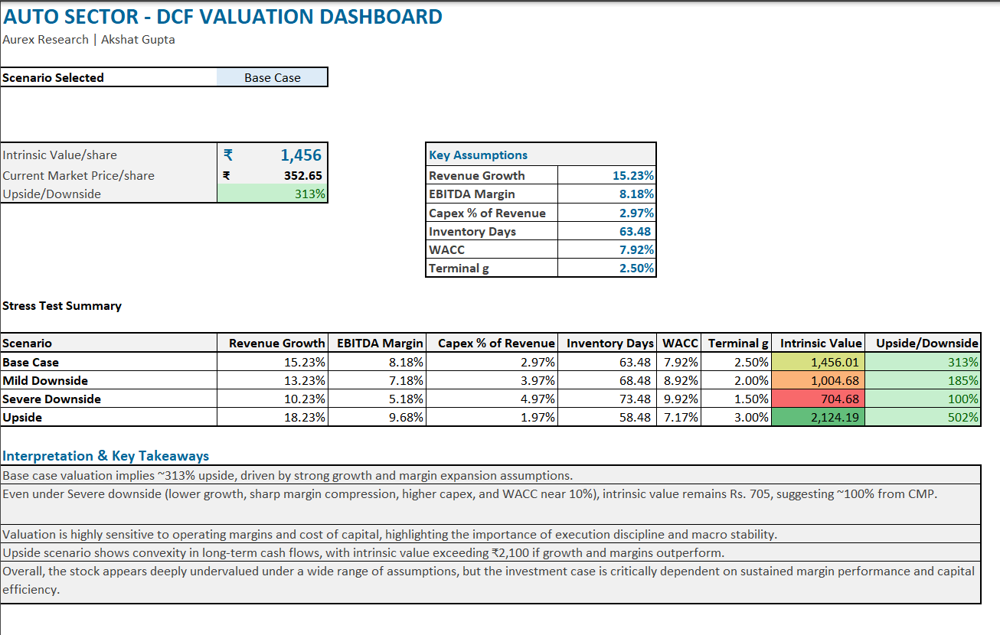
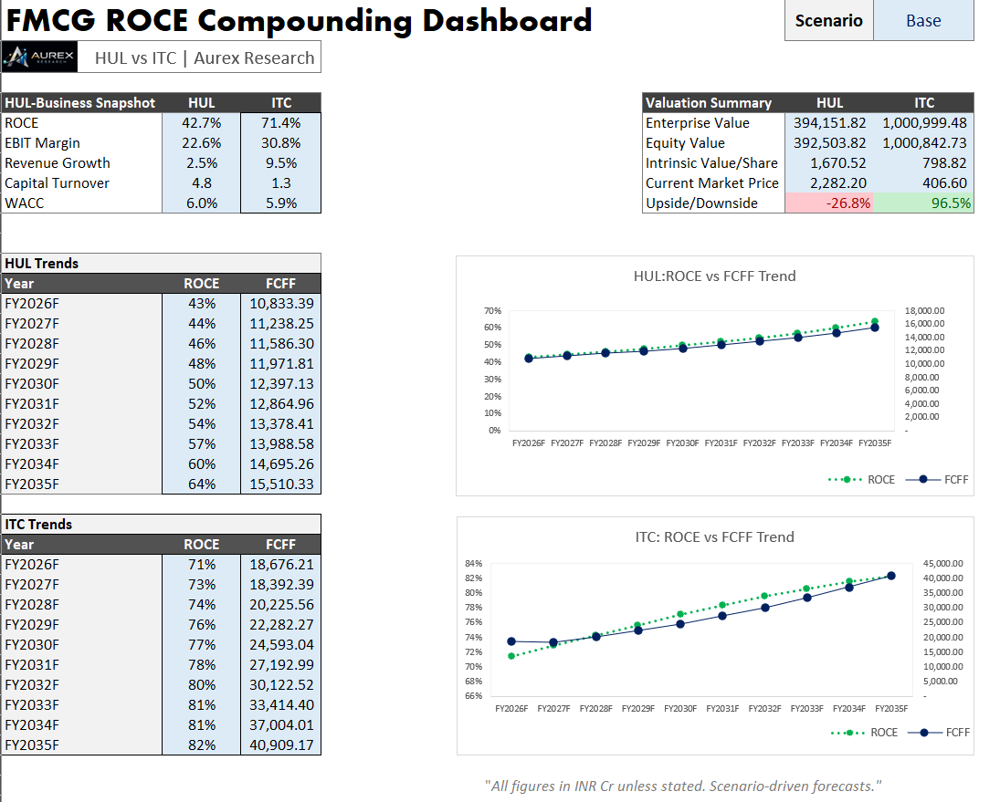

# Aurex Research  
**Independent Financial Research & Valuation Frameworks**  
*By Akshat Gupta*


---

## 📌 About Aurex Research

**Aurex Research** is an independent financial research and education initiative focused on  
**data-driven analysis, valuation frameworks, ROCE/quality models, and long-form writing** on markets and businesses.

The goal is to bridge:  
**financial statements → structured models → clear written insights.**

Through Aurex Research, I:
- build analyst-grade financial and valuation models,  
- design dashboards and analytical frameworks, and  
- publish blogs and case-style articles to explain *how to think* about value creation, risk, and long-term fundamentals.

This repository serves as the central hub for the **models, visuals, and documents** that support that research and writing.

---

## 🚀 Flagship Projects

### 🔹 Auto Sector – Driver-Based DCF Valuation Model
A comprehensive **3-statement integrated FCFF DCF model** for an Indian auto major, built using a driver-based forecasting approach.

**Key features:**
- Driver-based revenue and EBITDA margin forecasting  
- Detailed working capital schedules (inventory, receivables, payables)  
- Capex & depreciation modeling  
- Dynamic WACC build-up  
- FCFF-based DCF valuation with terminal value  
- Sensitivity analysis (WACC × terminal growth heatmap)  
- Multi-variable stress testing across key drivers  
- Interactive **Output Dashboard** with scenario selection  
- Dedicated **Checks** for model integrity  

📂 Model files:  
`DCF-Models/`

---

### 🔹 FMCG ROCE Compounding Model – HUL vs ITC
A **ROCE-driven compounding framework** comparing two FMCG leaders to study how capital efficiency converts into long-term cash flows and intrinsic value.

**Key features:**
- Driver-based growth, margin & reinvestment modeling  
- Capital employed build-up (PPE + working capital + operating assets)  
- ROCE → FCFF → DCF valuation linkage  
- Integrated 3-statement structure  
- Sensitivity & scenario stress testing  
- One-page premium **ROCE Compounding Dashboard**  
- Robust internal consistency **Checks**  
- Optimized terminal value share (~75–80% of EV)

📂 Model files:  
`DCF-Models/`

---

### 📊 Sample Visuals





---

## ✍️ Writing & Blogs

Alongside building models, I regularly write about:
- valuation frameworks & financial mental models,  
- sector performance and outlook,  
- financial modeling concepts, and  
- case-style market analysis.

These articles translate the analysis in this repository into **clear, educational insights**.

📝 Read on Substack / Medium:  
https://medium.com/@akshatgupta13427  

---

## 📊 Cross-Market Analytics

### 🔹 India & US Financial Analytics Dashboard
A Power BI–driven research framework analyzing India & US markets across:

- Macro indicators  
- Sector benchmarks  
- Company-level fundamentals  
- Capital efficiency & profitability  
- Valuation and risk diagnostics  

Enabling structured **cross-market and cross-sector comparison**.

📂 Visuals & charts:  
`assets/image/`

Sample visuals:


---

## 🧠 Skills & Frameworks Demonstrated

- Financial Modeling: integrated 3-statement, FCFF DCF  
- Valuation: intrinsic value, equity bridge, ROCE-based frameworks  
- Driver-based forecasting & scenario systems  
- Sensitivity & stress testing  
- Dashboard design for interpretation  
- Excel best practices: modular design, checks, governance  
- Power BI for financial & sector analytics  

---

## 📁 Repository Structure

```text
aurex-research/
│
├── DCF-Models/          → Excel-based valuation & ROCE frameworks (Screenshots only)
├── Files/              → CV and detailed research documents  
├── assets/image/       → Dashboards, heatmaps & research visuals  
└── README.md           → Project overview & documentation
