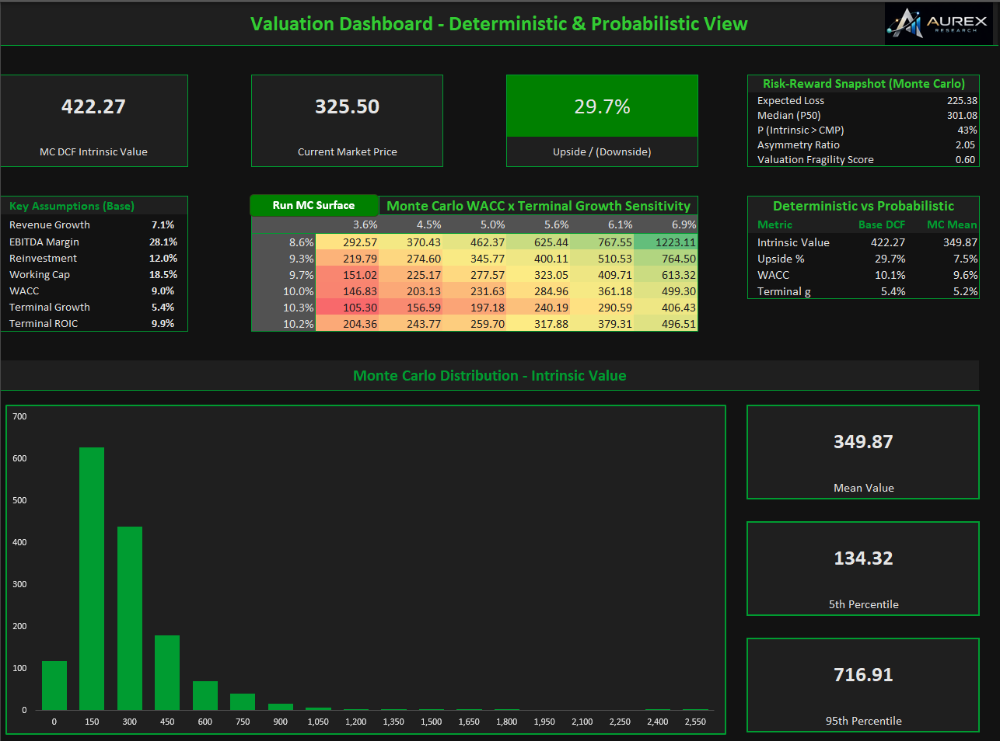

# Aurex Research  
**Independent Financial Research & Valuation Frameworks**  
*By Akshat Gupta*


---

## 📌 About Aurex Research

**Aurex Research** is an independent financial research and education initiative focused on  
**data-driven analysis, valuation frameworks, ROCE/quality models, and long-form writing** on markets and businesses.

The goal is to bridge:  
**financial statements → structured models → clear written insights.**

Through Aurex Research, I:
- build analyst-grade financial and valuation models,  
- design dashboards and analytical frameworks, and  
- publish blogs and case-style articles to explain *how to think* about value creation, risk, and long-term fundamentals.

This repository serves as the central hub for the **models, visuals, and documents** that support that research and writing.

---

## 🚀 Flagship Projects

### 🔹 Auto Sector – Driver-Based DCF Valuation Model
A comprehensive **3-statement integrated FCFF DCF model** for an Indian auto major, built using a driver-based forecasting approach.

**Key features:**
- Driver-based revenue and EBITDA margin forecasting  
- Detailed working capital schedules (inventory, receivables, payables)  
- Capex & depreciation modeling  
- Dynamic WACC build-up  
- FCFF-based DCF valuation with terminal value  
- Sensitivity analysis (WACC × terminal growth heatmap)  
- Multi-variable stress testing across key drivers  
- Interactive **Output Dashboard** with scenario selection  
- Dedicated **Checks** for model integrity  

📂 Model files:  
`DCF-Models/Models`

### 📊 Sample Visuals


---

### 🔹 FMCG ROCE Compounding Model – HUL vs ITC
A **ROCE-driven compounding framework** comparing two FMCG leaders to study how capital efficiency converts into long-term cash flows and intrinsic value.

**Key features:**
- Driver-based growth, margin & reinvestment modeling  
- Capital employed build-up (PPE + working capital + operating assets)  
- ROCE → FCFF → DCF valuation linkage  
- Integrated 3-statement structure  
- Sensitivity & scenario stress testing  
- One-page premium **ROCE Compounding Dashboard**  
- Robust internal consistency **Checks**  
- Optimized terminal value share (~75–80% of EV)

📂 Model files:  
`DCF-Models/Models`

### 📊 Sample Visuals


### 🔹 LBO + DCF Transaction Model (IT Services Case)
A premium Leveraged Buyout (LBO) transaction dashboard built within the same valuation workbook to analyze how operational performance, leverage, and exit assumptions translate into equity returns.
This framework complements traditional DCF analysis by adding a private equity lens — focusing on capital structure, debt paydown, and exit value creation, without making any investment recommendations.

**Key features:**

- Entry valuation snapshot (EV, EBITDA, entry multiple)
- Capital structure & funding mix (Debt vs Equity)
- Debt schedule with cash sweep and paydown logic
- Exit valuation using EV/EBITDA multiple
- Equity bridge from entry to exit (waterfall)
- Returns analysis: MOIC & Equity IRR
- Scenario-driven assumptions (holding period, leverage, cost of debt, fees)
- Integrated Transaction Summary Dashboard with charts
- Designed to be fully compatible with the underlying operating & DCF model

📂 Model files:  
`DCF-Models/Models`

### 📊 Sample Visuals

 

---

### 🔹 Valuation Dashboard - Deterministic & Probabilistic View
This project presents an advanced operating-driven valuation framework combined with Monte Carlo simulation to analyze intrinsic value under uncertainty. The model is built entirely in Excel and focuses on economic drivers, cash-flow generation, and probabilistic outcomes, rather than full accounting statements or point estimates.

**Key Features**

- Operating model–led valuation framework, linking revenue growth, profitability, reinvestment intensity, and capital efficiency directly to FCFF.
- Explicit modeling of **value drivers** such as operating margins, reinvestment rates, terminal ROIC, and cost of capital.
- **Monte Carlo simulation engine** to capture uncertainity across key assumptions (growth, margins, reinvestment, WACC, terminal growth)
- **Probability-based valuation outputs,** including likelihood of intrinsic value exceeding market price and expected payoff metrics.
- **Percentile-driven WACC x terminal growth sensitivity surface,** derived from simulated distributions rather than static inputs.
- Distribution analysis through **histogram and risk metrics,** emphasizing downside severity, upside convexity, and valuation fragility.
- **Premium Output Dashboard** designed to communicate ranges, probabilities, and economic intuition clearly without relying on investment recommendations.

The framework emphasizes **how value is created and how fragile it is to assumptions,** making it suitable for research, learning, and analytical presentation rather than stock selection.

📂 Model files:  
`DCF-Models/Models`

### 📊 Sample Visuals



---

###  🔹 Monte Carlo Valuation - Distribution & Risk View
- End-to-end operating-model–linked valuation framework, integrating FCFF-based DCF with probabilistic Monte Carlo simulation
- Distribution-aware valuation engine capturing uncertainty across growth, margins, reinvestment, ROIC, WACC, and terminal assumptions
- Dedicated Model Health & Governance layer to validate valuation logic, simulation integrity, and economic consistency
- Scenario-agnostic design enabling risk-reward assessment beyond point estimates, including downside, dispersion, and value drivers
- Research-grade structure, aligned with published academic and practitioner work (SSRN & independent research publications)
- Fully modular, extensible architecture suitable for advanced equity research, strategy, and capital allocation analysis

📂 Model files:  
`DCF-Models/Models`

### 📊 Sample Visuals


---

## ✍️ Writing & Blogs

Alongside building models, I regularly write about:
- valuation frameworks & financial mental models,  
- sector performance and outlook,  
- financial modeling concepts, and  
- case-style market analysis.

These articles translate the analysis in this repository into **clear, educational insights**.

📝 Read on Substack:  
https://substack.com/@aurexresearch 

---

## 📊 Cross-Market Analytics

### 🔹 India & US Financial Analytics Dashboard
A Power BI–driven research framework analyzing India & US markets across:

- Macro indicators  
- Sector benchmarks  
- Company-level fundamentals  
- Capital efficiency & profitability  
- Valuation and risk diagnostics  

Enabling structured **cross-market and cross-sector comparison**.

📂 Visuals & charts:  
`assets/image/`

Sample visuals:


---

## 🧠 Skills & Frameworks Demonstrated

- Financial Modeling: integrated 3-statement, FCFF DCF, Monte Carlo engines
- Valuation: intrinsic value, equity bridge, ROCE-based frameworks  
- Driver-based forecasting & scenario systems  
- Sensitivity & stress testing  
- Dashboard design for interpretation  
- Excel best practices: modular design, checks, governance  
- Power BI for financial & sector analytics

---

Note: **Use Excel 365 version to view the models**

## 📁 Repository Structure

```text
aurex-research/
│
├── DCF-Models/          → Excel-based valuation & ROCE frameworks (Screenshots only)
├── Files/              → CV and detailed research documents  
├── assets/image/       → Dashboards, heatmaps & research visuals  
├── README.md           → Project overview & documentation
└── DCF-Models/Models   → Excel-based valuation models (Excel)
